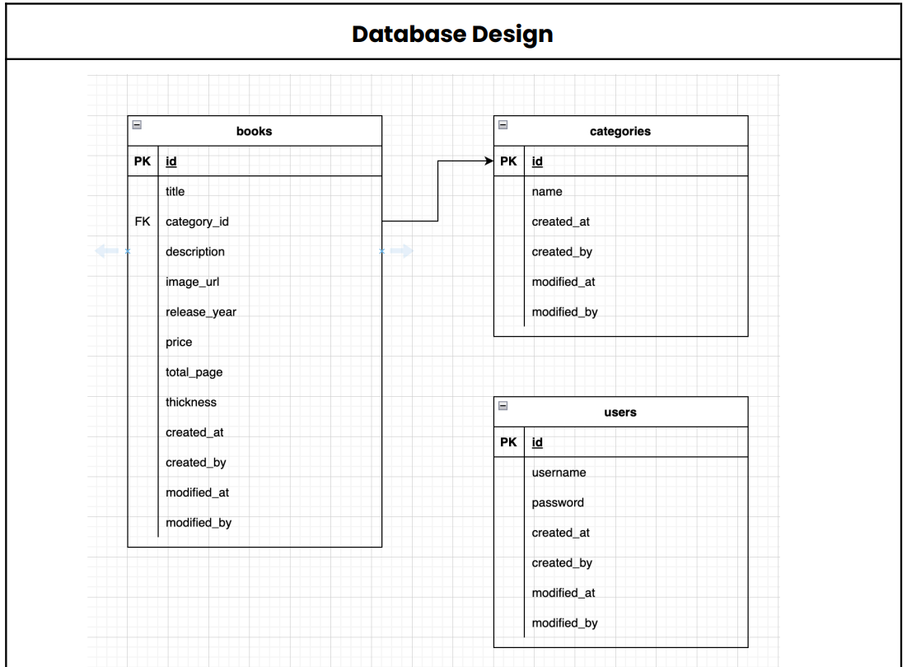

# Book Management API
<ul>
<li>Nama : Kukuh Wicaksono</li>
<li>Quiz 3 - Pekan 3 (Coding) Bootcamp Golang Sanbercode Batch 59</li>
</ul>


### ERD
Sistem Informasi Acara Komunitas dan Tiket ini memiliki 5 tabel :
<ul>
<li>Tabel users</li>
<li>Tabel book</li>
<li>Tabel category book</li>
</ul>


## AKSES TOKEN

## Endpoint Login 
Endpoint Login digunakan untuk autentikasi pengguna dan mendapatkan token JWT.

Method | Path | Keterangan | Auth
------------- | ------------- | ------------- | -------------
***POST*** | *`/login`* | Mengautentikasi pengguna dan mengembalikan token JWT jika kredensial valid. | No 

```

## Fitur and API Endpoints

- **Buku**
  - **`GET /api/books`**             Mendapatkan daftar semua buku   
  - **`POST /api/books`**            Menambahkan buku baru
  ```json
    {
    "id": 3,
    "title": "Algorithms and Data Structures",
    "description": "A comprehensive book on algorithms and data structures for computer science enthusiasts.",
    "image_url": "https://example.com/images/algorithms_data_structures.jpg",
    "release_year": 2023,
    "price": 350000,
    "total_page": 500,
    "category_id": 3,
    "created_at": "2023-09-08T14:15:00Z",
    "created_by": "admin",
    "modified_at": "2023-09-08T14:15:00Z",
    "modified_by": "admin"
  }
  ```
  - **`GET /api/books/:id`**         Mendapatkan detail buku berdasarkan ID
  - **`DELETE /api/books/:id`**      Menghapus buku berdasarkan ID
  - **`PUT /api/books/:id`**         Memperbarui buku berdasarkan ID
  
  
- **Kategori**
  - **`POST /api/categories`**       Menambahkan kategori baru
  - **`GET /api/categories`**        Mendapatkan daftar semua kategori
  - **`GET /api/categories/:id`**    Mendapatkan detail kategori berdasarkan ID
  - **`PUT /api/categories/:id`**    Memperbarui detail kategori berdasarkan ID
  - **`DELETE /api/categories/:id`** Menghapus kategori dari sistem berdasarkan ID

## Struktur Proyek

```bash
.
├── go.mod             # Informasi dependensi dan versi modul Go
├── go.sum             # Checksum dari dependensi yang digunakan
├── config/            # Konfigurasi aplikasi
│   └── .env           # File environment untuk menyimpan variabel konfigurasi
├── controllers/       # Handler untuk endpoints
│   ├── book.go        # Logika untuk resource buku (CRUD Buku)
│   ├── category.go    # Logika untuk resource kategori buku (CRUD Kategori)
│   ├── login.go       # Logika untuk otentikasi pengguna (Login)
│   └── user.go        # Logika untuk resource pengguna (CRUD Pengguna)
├── database/          # Konfigurasi database dan migrasi
│   ├── database.go    # Koneksi dan pengaturan database
│   └── sql_migrations/  # Direktori untuk file migrasi SQL
│       ├── 1_initiate_book.sql     # SQL untuk membuat tabel buku
│       ├── 2_initiate_category.sql # SQL untuk membuat tabel kategori
│       └── 3_initiate_user.sql     # SQL untuk membuat tabel pengguna
├── helpers/           # Fungsi utilitas umum
│   └── jwt.go         # Fungsi helper untuk JWT (JSON Web Token)
├── middleware/        # Middleware untuk aplikasi
│   └── middleware.go  # Implementasi middleware (misalnya, otentikasi, logging)
├── repository/        # Interaksi langsung dengan database
│   ├── book.go        # Implementasi repository untuk resource buku
│   ├── category.go    # Implementasi repository untuk resource kategori
│   └── user.go        # Implementasi repository untuk resource pengguna
├── seeder/            # Data seeder untuk populasi awal database
│   └── user_seeder.go # Seeder untuk pengguna awal di database
└── structs/           # Definisi struktur data (model)
    └── struct.go      # Definisi struct untuk buku, kategori, pengguna, dll.

```

Aplikasi akan berjalan di http://localhost:8080.


  
## Teknologi yang Digunakan

- **Go**: Bahasa pemrograman untuk logika backend.
- **Gin Gonic**: Web framework untuk membangun API.
- **MySQL**: Basis data untuk menyimpan data buku dan kategori.

## Persiapan Sebelum Menjalankan

1. Pastikan **Go** sudah terinstall. Anda bisa mendownloadnya dari [sini](https://golang.org/dl/).
2. Buat dan konfigurasi database MySQL yang dibutuhkan untuk API ini.
3. Sesuaikan konfigurasi database di file `config.yaml` atau di dalam kode jika ada.

## Menjalankan Aplikasi

Untuk menjalankan aplikasi ini secara lokal:

1. Clone repository:
   ```bash
   git clone https://github.com/cfra321/sb-go-batch-59-kukuh.git
   cd sb-go-batch-59-kukuh

Jalankan aplikasi menggunakan perintah berikut:

```bash
go run main.go
```

## License

Dokumentasi ini MIT


